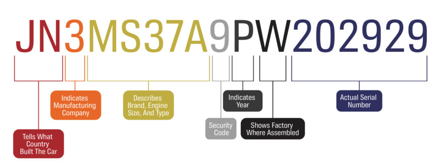
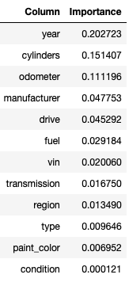
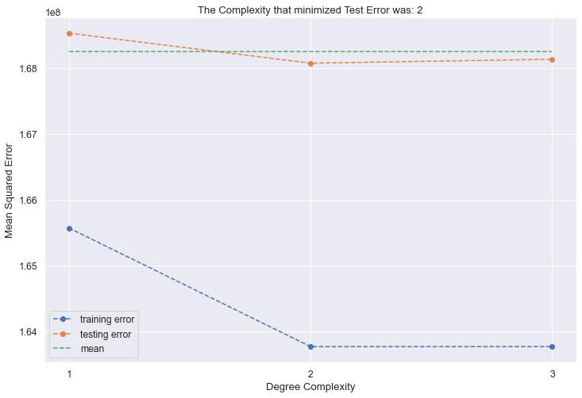
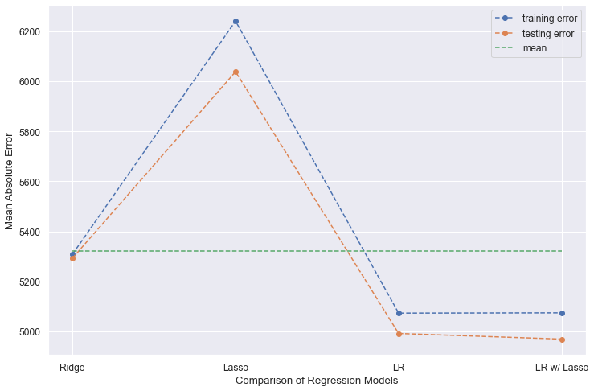
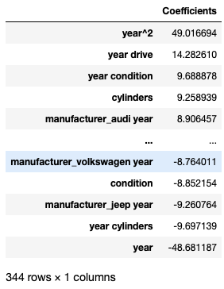
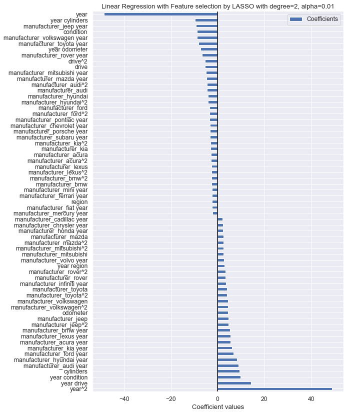
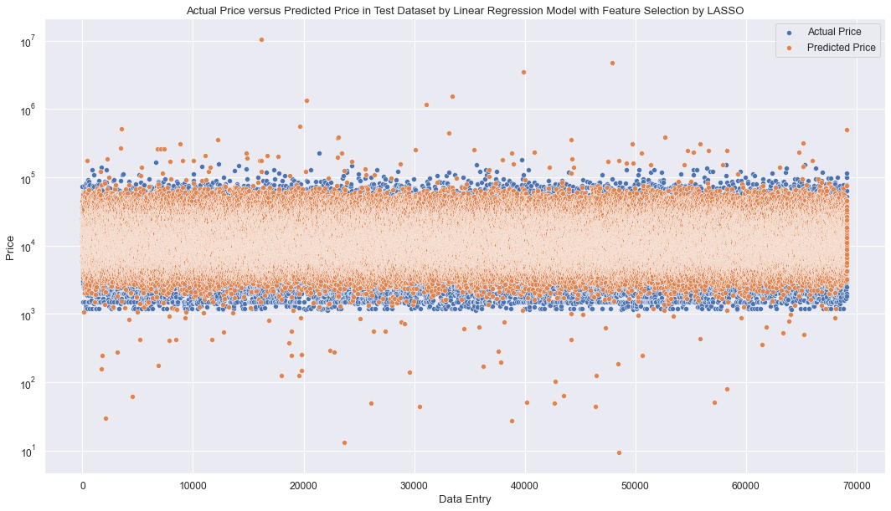

# Used-Car-Pricing
Exploring a dataset from Kaggle that contains information on 3 million used cars for clear recommendations as to what consumers value in a used car.

The input file in data folder!

The assignment of Jupyter notebook for pricing model of a used car is [pricing.11.Aykan.ipynb](pricing.11.Aykan.ipynb).

## What drives the price of a car?
In this assignment, a dataset from Kaggle is used which has 3 million used cars. The objective is to understand what factors influence price of a used car. As a result of the analysis, a recommendation about what consumers value in a used car was provided at the end below.

## Business Understanding
Used Car Dealership would like to understand what factors weigh in pricing a used car. There are highly influential features that directly contribute to the price of a car versus personal preferences. In this study, features will be identified as important and analyzed for multicollinearity. Finally, several models will be built and best model result will be used in the conclusion as outcome. The objective of this study to find out the important features which are making the price of a used car and create a model to estimate price of a used car and share the results with the dealership. A Kaggle dataset is shared for this purpose: Here, price is the target variable and the rest of dataset is features. Categorical features must be converted to numeric features so that they can be utilized in variance inflation factor and feature importance analysis also model creation.

## Data Understanding
The dataset consists of these columns: _id, region, price, year, manufacturer, model, condition, cylinders, fuel, odometer, title_status, transmission, VIN, drive, size, type, paint_color and state_. Among those columns _id_ is redundant; region, price and state have data consistency, there is no missing data; the rest of columns have all missing data. Records must be analyzed to remove duplicated information. Analyze all string data objects and come up with a method for each to convert some sort of numeric feature.

### Understanding Vehicle Identification Number (VIN)
For more information about what VIN is please refer to this wiki page:   [https://en.wikipedia.org/wiki/Vehicle_identification_number](https://en.wikipedia.org/wiki/Vehicle_identification_number). This understanding about VIN is needed to fill missing columns, that's why it is a valuable information to get familiar with.

A VIN consists of Manufacturer, Brand/Model/type, Year, Factory and Serial Number as shown in below image:


#### World Manufacturer Identifier
The first three digits of a vehicle’s VIN make up the World Manufacturer Identifier (WMI).
- The first digit defines the country of origin or the final point of assembly of your vehicle.
- The second digit indicates the manufacturer and the region where your vehicle was produced.
- The third digit, when coupled with the first two digits, indicates your vehicle’s type or manufacturing division.
#### Vehicle Description Section
Digits in position 4 through 9 make up the Vehicle Description Section (VDS).
- The fourth through eighth digits describe your vehicle’s model, body type, restraint system, transmission type, and engine code.
- The ninth digit is the check digit, which is used to detect fraudulent VINs. The number that appears in the ninth position varies and is based on a mathematical formula developed by the U.S. Department of Transportation.
#### Vehicle Identifier Section
Digits in position 10 through 17 make up the Vehicle Identifier Section (VIS).
- The tenth digit indicates the year, which only applies to vehicles built in or after 1981 since the VIN format was not standardized until that year.

## Data preparation 
Data transformation based per Data Understanding applied here. model column has some free form entries I can utilize to fill missing column values as well as VIN entries reveal some very useful information that I can fill some missing values.

### Data correction steps
- Drop duplicated records if any
- Remove duplicated VIN entries per price, odometer and VIN search
- Nullify VIN entries when they are invalid, containing ‘000000’
- Find out ’scion’ vehicles in model column and set them as ‘Toyota’ in manufacturer column
- Fill 4wd/2wd information from model in drive
- Fill automatic/manual from model in transmission
- Build a known lookup table per feature to fill manufacturer, type, paint color, fuel, size and condition from model
- Build a lookup table of VINs per manufacturer/model and optionally year to fill cylinders, fuel, transmission, drive, size, type, manufacturer, model and year
- Build a known lookup table per feature from model for cross reference of manufacturer/model and optionally year to fill cylinders, fuel, transmission, drive, size and type

### Data transformation steps
- VIN - make it binary 1/0 if exists and drop original VIN column
- Create a regions by states - 6 regions per [https://www.infoplease.com/us/states/regions-of-the-us](https://www.infoplease.com/us/states/regions-of-the-us) 
- replace awd/rwd/fwd with 4wd/2wd - make it binary 1/0
- replace scion with toyota, ram with dodge in manufacturer
- replace manual/automatic with binary 0/1 in transmission
- fix missing condition from title
- Remove all unknown cylinder entries
- Fill paint color with unknown when null

### Outliers
- Remove all entries when price is out of this range ($1100, $249999)
- Remove all entries when odometer is out of this range (0, 9999999) except when condition is new. 
- Remove manufacturer group has a single entry.

### Column Cleanup
- Remove id,city,state,VIN,size,title_status and model columns.

### NaN Values
- Drop all remaining rows with  NaN values.

### Convert categorical feature to numerical feature
- Cylinders as numbers only
- Fuel:
    - vehicles.loc[vehicles['fuel'] == 'gas', 'fuel'] = 1
    - vehicles.loc[vehicles['fuel'] == 'diesel', 'fuel'] = 2
    - vehicles.loc[vehicles['fuel'] == 'hybrid', 'fuel'] = 3
    - vehicles.loc[vehicles['fuel'] == 'electric', 'fuel'] = 4
    - vehicles.loc[vehicles['fuel'] == 'other', 'fuel'] = 5
- Condition:
    - vehicles.loc[vehicles['condition'] == 'new', 'condition'] = 1
    - vehicles.loc[vehicles['condition'] == 'like new', 'condition'] = 2
    - vehicles.loc[vehicles['condition'] == 'excellent', 'condition'] = 3
    - vehicles.loc[vehicles['condition'] == 'good', 'condition'] = 4
    - vehicles.loc[vehicles['condition'] == 'clean', 'condition'] = 5
    - vehicles.loc[vehicles['condition'] == 'fair', 'condition'] = 6
    - vehicles.loc[vehicles['condition'] == 'salvage', 'condition'] = 7
- Type:
    - vehicles.loc[vehicles['type'] == 'sedan', 'type'] = 1
    - vehicles.loc[vehicles['type'] == 'SUV', 'type'] = 2
    - vehicles.loc[vehicles['type'] == 'truck', 'type'] = 3
    - vehicles.loc[vehicles['type'] == 'pickup', 'type'] = 4
    - vehicles.loc[vehicles['type'] == 'coupe', 'type'] = 5
    - vehicles.loc[vehicles['type'] == 'hatchback', 'type'] = 6
    - vehicles.loc[vehicles['type'] == 'wagon', 'type'] = 7
    - vehicles.loc[vehicles['type'] == 'van', 'type'] = 8
    - vehicles.loc[vehicles['type'] == 'convertible', 'type'] = 9
    - vehicles.loc[vehicles['type'] == 'mini-van', 'type'] = 10
    - vehicles.loc[vehicles['type'] == 'offroad', 'type'] = 11
    - vehicles.loc[vehicles['type'] == 'bus', 'type'] = 12
    - vehicles.loc[vehicles['type'] == 'other', 'type'] = 13
- Region:
    - vehicles.loc[vehicles['region'] == 'west', 'region'] = 1
    - vehicles.loc[vehicles['region'] == 'south', 'region'] = 2
    - vehicles.loc[vehicles['region'] == 'midwest', 'region'] = 3
    - vehicles.loc[vehicles['region'] == 'southwest', 'region'] = 4
    - vehicles.loc[vehicles['region'] == 'midatlantic', 'region'] = 5
    - vehicles.loc[vehicles['region'] == 'newengland', 'region'] = 6
- Convert float to int for year, transmission, drive and vin.

### Correlation Analysis
There are very a few observations out of the correlation matrix:
- Priced higher when VIN number exists
- Four wheel drive vehicles priced higher
- Priced higher when fuel type is other than gas
- More the cylinders are priced higher
- Higher the odometer lower the price
- Newer the model higher the price
- Condition, manual/automatic transmission and type of vehicle do not seem play role
- Region has less influence
Also, some cross correlation among features per matrix:
- Newer vehicles tend to have less number of cylinders but more VIN listed in sales
- More number of cylinders if four wheel drive
- Newer models are slightly more four wheel drive
- When VIN is listed odometer has slightly less milage

## Modeling 
Before modeling I checked Variance Inflation Factor (VIF) and Permutation Importance. VIF showed no multicollinearity. Permutation Importance interestingly reported condition and region are not influencing models as below:


I only picked up 5 features per permutation importance list: 'year', 'cylinders', 'odometer', 'manufacturer' and 'drive' to build models. Besides, I could include region and condition to categorize properly even though the attribute importance thinks differently per evaluation steps.

I ran a model complexity analysis to decide about degree complexity:


I kept it at degree=2 for all models. I built 4 models: Ridge, LASSO, Linear Regression and Linear Regression with LASSO feature selection after several evaluations.

## Evaluation 
I decided to include region and condition to categorize properly even though the attribute importance thinks differently per evaluation steps to influence models with more appropriate features. It helped slightly with models’ mean absolute errors. 

I build 4 regression models Linear Regression with LASSO feature selection outperformed others in mean absolute error:



The model Linear Regression with LASSO feature selection outperformed all others, the model generated and kept only 344 feature degree=2 combinations.


Condition is shown as a negative influencer in above and below charts:



The comparison of actual and predicted price shown in the below image for visualization:


Region assignment may need to be reevaluated in later phases as a side note.

## Deployment 
Based on the research and model outcome, the influential features of a used vehicle can be narrowed down to these features:
- Year
- Cylinders
- Condition
- Drivetrain
- Region
- Odometer

Remarks about positive price points:
- New vehicles are high priced at the square power of year
- The product of year and drive influence higher price
- The product of year and condition influence higher price
- The product of year and region influence higher price
- Number of cylinders influence higher price
- The coefficient of year and along manufacturer influence higher price
- Manufacturers Volkswagen, Jeep, Rover, Mitsubishi, Mazda, Honda, Chrysler and Cadillac influence higher price.

Remarks about negative price points:
- Higher odometer reading on newer models penalize price, as condition worsens lower the price. 
- Manufacturers BMW, Lexus, Acura, Kia, Ford, Hyundai and Audi tend to have lower prices.

